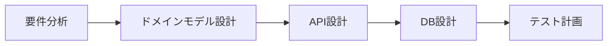
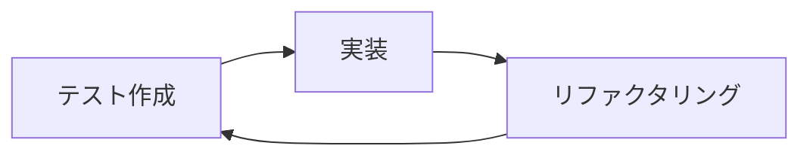

# 開発ルール・ガイドライン総合インデックス

## 概要

このドキュメントは、Go DDDプロジェクトにおける全ての開発ルール、ガイドライン、ベストプラクティスへの総合案内です。新規参加者のオンボーディングから日常的な開発作業まで、このインデックスから適切なドキュメントにアクセスできます。

## 📚 ドキュメント体系

### 🎯 基本方針・アーキテクチャ
- **[アーキテクチャ設計書](../README.md)** - プロジェクト全体のアーキテクチャ方針
- **[ディレクトリ構成](./rules/coding-standards.md#ディレクトリ構成)** - FSD + DDD + CQRS構成

### 📋 コーディング規約・ルール

#### 必須ルール
- **[コーディング規約](./rules/coding-standards.md)** - Go言語とDDDパターンに基づく基本ルール
- **[エラーハンドリング](./rules/error-handling.md)** - レイヤー別エラー処理の完全ガイド
- **[API設計ルール](./rules/api-design-rules.md)** - REST APIの設計と実装標準

#### 品質・パフォーマンス
- **[テストガイドライン](./rules/testing-guidelines.md)** - TDD実践とテスト戦略
- **[パフォーマンス規則](./rules/performance-rules.md)** - 最適化とモニタリング指針
- **[セキュリティガイドライン](./rules/security-guidelines.md)** - セキュリティ要件と実装標準

#### データ・インフラ
- **[データベース規約](./rules/database-conventions.md)** - DB設計・マイグレーション・最適化
- **[ドキュメント規則](./rules/documentation-rules.md)** - ドキュメント作成・管理標準

### 🔄 ワークフロー・プロセス
- **[Gitワークフロー](./rules/git-workflow.md)** - ブランチ戦略・コミット・リリース管理
- **[コードレビューチェックリスト](./rules/review-checklist.md)** - レビュー基準と手順

### 🤖 AI開発支援
- **[Copilot利用指針](./ai-development/copilot-instructions.md)** - GitHub Copilot活用ガイド
- **[プロンプトテンプレート](./ai-development/prompt-templates.md)** - AI支援開発用テンプレート集
- **[AI生成コードレビュー](./ai-development/ai-review-checklist.md)** - AI生成コードの品質管理

## 🚀 用途別クイックアクセス

### 新規参加者向け
1. **[アーキテクチャ設計書](../README.md)** で全体理解
2. **[コーディング規約](./rules/coding-standards.md)** で基本ルール習得
3. **[Gitワークフロー](./rules/git-workflow.md)** で作業手順確認
4. **[テストガイドライン](./rules/testing-guidelines.md)** でTDD実践方法習得

### 日常開発作業
1. **[Copilot利用指針](./ai-development/copilot-instructions.md)** でAI活用
2. **[エラーハンドリング](./rules/error-handling.md)** で適切なエラー処理
3. **[API設計ルール](./rules/api-design-rules.md)** でエンドポイント設計
4. **[コードレビューチェックリスト](./rules/review-checklist.md)** でレビュー実施

### 機能開発・設計
1. **[データベース規約](./rules/database-conventions.md)** でDB設計
2. **[パフォーマンス規則](./rules/performance-rules.md)** で最適化
3. **[セキュリティガイドライン](./rules/security-guidelines.md)** で脅威対策
4. **[プロンプトテンプレート](./ai-development/prompt-templates.md)** でAI支援設計

### 運用・保守
1. **[ドキュメント規則](./rules/documentation-rules.md)** で資料整備
2. **[AI生成コードレビュー](./ai-development/ai-review-checklist.md)** で品質管理
3. **[テストガイドライン](./rules/testing-guidelines.md)** でカバレッジ維持

## 📖 レイヤー別ガイド

### プレゼンテーション層（Handler）
- **主要ルール**: [API設計ルール](./rules/api-design-rules.md)
- **エラー処理**: [エラーハンドリング - Handler層](./rules/error-handling.md#プレゼンテーション層handler)
- **セキュリティ**: [セキュリティガイドライン - 入力検証](./rules/security-guidelines.md#入力検証サニタイゼーション)
- **テスト**: [テストガイドライン - E2Eテスト](./rules/testing-guidelines.md#e2eテスト)

### アプリケーション層（Usecase）
- **主要ルール**: [コーディング規約 - Usecase層](./rules/coding-standards.md#usecase層)
- **CQRS実装**: [コーディング規約 - CQRS](./rules/coding-standards.md#cqrscommand-query-responsibility-segregation)
- **エラー処理**: [エラーハンドリング - Usecase層](./rules/error-handling.md#アプリケーション層usecase)
- **テスト**: [テストガイドライン - 統合テスト](./rules/testing-guidelines.md#統合テスト)

### ドメイン層
- **主要ルール**: [コーディング規約 - Domain層](./rules/coding-standards.md#domain層)
- **DDD実装**: [コーディング規約 - DDDパターン](./rules/coding-standards.md#dddpatterns)
- **エラー処理**: [エラーハンドリング - Domain層](./rules/error-handling.md#ドメイン層)
- **テスト**: [テストガイドライン - ユニットテスト](./rules/testing-guidelines.md#ユニットテスト)

### インフラストラクチャ層
- **主要ルール**: [データベース規約](./rules/database-conventions.md)
- **リポジトリ実装**: [コーディング規約 - Repository](./rules/coding-standards.md#repository実装)
- **パフォーマンス**: [パフォーマンス規則 - DB最適化](./rules/performance-rules.md#データベースパフォーマンス)
- **セキュリティ**: [セキュリティガイドライン - データアクセス](./rules/security-guidelines.md#データアクセスセキュリティ)

## 🛠️ 開発フロー

### 機能開発の標準手順

#### 1. 計画・設計フェーズ

**参照ドキュメント**:
- [API設計ルール](./rules/api-design-rules.md)
- [データベース規約](./rules/database-conventions.md)
- [テストガイドライン](./rules/testing-guidelines.md)

#### 2. 実装フェーズ（TDD）

**参照ドキュメント**:
- [テストガイドライン](./rules/testing-guidelines.md)
- [Copilot利用指針](./ai-development/copilot-instructions.md)
- [プロンプトテンプレート](./ai-development/prompt-templates.md)

#### 3. レビュー・統合フェーズ

**参照ドキュメント**:
- [コードレビューチェックリスト](./rules/review-checklist.md)
- [AI生成コードレビュー](./ai-development/ai-review-checklist.md)
- [Gitワークフロー](./rules/git-workflow.md)

## 🔍 チェックリスト

### 機能完成チェック
- [ ] 全てのレイヤーが適切に実装されているか
- [ ] DDDパターンに準拠しているか
- [ ] CQRS分離が適切に行われているか
- [ ] エラーハンドリングが完全に実装されているか
- [ ] セキュリティ要件が満たされているか
- [ ] パフォーマンス要件が満たされているか
- [ ] テストカバレッジが80%以上あるか
- [ ] ドキュメントが更新されているか

### リリース前チェック
- [ ] 全ての統合テストが通過するか
- [ ] セキュリティスキャンで問題がないか
- [ ] パフォーマンステストで基準を満たすか
- [ ] API仕様書が更新されているか
- [ ] マイグレーション手順が確認済みか

## 📋 ルール適用の優先順位

### 必須レベル（違反は即修正）
1. **セキュリティルール** - 脆弱性に直結
2. **エラーハンドリング** - システム安定性に直結
3. **API設計ルール** - 外部互換性に影響

### 推奨レベル（レビューで指摘）
1. **コーディング規約** - 保守性に影響
2. **パフォーマンス規則** - ユーザー体験に影響
3. **テストガイドライン** - 品質に影響

### 改善レベル（継続的改善）
1. **ドキュメント規則** - 知識共有に影響
2. **Gitワークフロー** - チーム効率に影響

## 🔄 ルール更新・改善プロセス

### 四半期レビュー
- ルールの実効性評価
- 新技術・ベストプラクティスの反映
- チームフィードバックの収集・反映

### 随時更新
- 重大な問題発見時の緊急更新
- 新機能・ライブラリ導入時の追加
- 外部要求（セキュリティ、法規制）への対応

## 📞 サポート・質問

### ルール解釈・適用に関する質問
1. まず該当ドキュメントの確認
2. 過去のコードレビュー事例の参照
3. チーム内での議論・合意形成

### ルール改善提案
1. GitHub Issueでの提案
2. チーム会議での議論
3. 実験的実装とフィードバック収集

## 🏁 まとめ

このインデックスは、Go DDDプロジェクトの全ての開発活動における品質、セキュリティ、パフォーマンス、保守性を確保するための包括的なガイドシステムです。

**重要な心構え**:
- ルールは品質向上の手段であり、目的ではない
- プロジェクトの成功とチームの生産性向上が最終目標
- 継続的な改善と学習の姿勢を保つ
- AI支援ツールを活用しつつ、人間の判断を重視する

新しいメンバーは順序立ててドキュメントを学習し、経験豊富なメンバーは日常の参照資料として活用してください。
