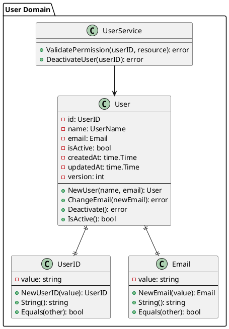

# ドキュメント規約

## 概要

Go DDD プロジェクトにおけるドキュメント作成・管理のガイドラインとベストプラクティスを定義します。

## 基本原則

### ドキュメント作成原則
- **正確性**: 実装と一致した正確な情報
- **一貫性**: 統一されたフォーマットと構造
- **実用性**: 開発者が実際に活用できる内容
- **保守性**: 継続的な更新とメンテナンス

## ドキュメント構造

### プロジェクト全体構造

```
docs/
├── README.md                  # プロジェクト概要
├── ARCHITECTURE.md            # アーキテクチャ設計書
├── SETUP.md                   # 開発環境セットアップ
├── DEPLOYMENT.md              # デプロイメント手順
├── API.md                     # API仕様書
├── DATABASE.md                # データベース設計書
├── CHANGELOG.md               # 変更履歴
├── CONTRIBUTING.md            # 貢献ガイド
├── rules/                     # 開発ルール
│   ├── coding-standards.md
│   ├── git-workflow.md
│   ├── testing-guidelines.md
│   └── ...
├── diagrams/                  # アーキテクチャ図
│   ├── system-overview.puml
│   ├── domain-model.puml
│   └── sequence-diagrams/
├── examples/                  # 実装例・サンプル
│   ├── api-examples/
│   ├── test-examples/
│   └── configuration/
└── troubleshooting/           # トラブルシューティング
    ├── common-issues.md
    ├── performance.md
    └── debugging.md
```

## README作成規約

### 基本構造

```markdown
# プロジェクト名

[](build-url)
[](coverage-url)
[](go-url)

## 概要

プロジェクトの簡潔な説明（1-2段落）

## 特徴

- 主要な機能や特徴をリスト形式で記載
- DDD（Domain-Driven Design）アーキテクチャ
- CQRS（Command Query Responsibility Segregation）
- Feature Sliced Design

## 技術スタック

| 分類 | 技術 | バージョン |
|------|------|------------|
| 言語 | Go | 1.21+ |
| フレームワーク | Echo | v4.11+ |
| データベース | PostgreSQL | 15+ |
| テスト | Testify | v1.8+ |

## クイックスタート

### 前提条件

- Go 1.21以上
- Docker & Docker Compose
- Make

### インストール・実行

\`\`\`bash
# リポジトリクローン
git clone https://github.com/your-org/go-ddd-example.git
cd go-ddd-example

# 依存関係インストール
make setup

# データベース起動・初期化
make db-setup

# アプリケーション起動
make dev
\`\`\`

## API仕様

### エンドポイント概要

| メソッド | エンドポイント | 説明 |
|----------|----------------|------|
| GET | `/api/v1/users` | ユーザー一覧取得 |
| POST | `/api/v1/users` | ユーザー作成 |
| GET | `/api/v1/users/{id}` | ユーザー詳細取得 |

詳細は [API仕様書](docs/API.md) を参照してください。

## プロジェクト構造

\`\`\`
feature/
└── user/
    ├── domain/          # ビジネスロジック
    ├── infra/           # インフラストラクチャ
    ├── usecase/         # アプリケーションロジック
    └── handler.go       # プレゼンテーション
\`\`\`

## 開発

### 利用可能なコマンド

\`\`\`bash
make dev              # 開発サーバー起動
make test             # テスト実行
make test-coverage    # カバレッジ付きテスト
make lint             # コード品質チェック
make format           # コードフォーマット
\`\`\`

### 開発ガイドライン

- [コーディング規約](docs/rules/coding-standards.md)
- [Git ワークフロー](docs/rules/git-workflow.md)
- [テストガイドライン](docs/rules/testing-guidelines.md)

## デプロイメント

[デプロイメント手順](docs/DEPLOYMENT.md) を参照してください。

## 貢献

プロジェクトへの貢献については [CONTRIBUTING.md](docs/CONTRIBUTING.md) を参照してください。

## ライセンス

[MIT License](LICENSE)

## サポート

- Issues: [GitHub Issues](https://github.com/your-org/go-ddd-example/issues)
- Wiki: [プロジェクトWiki](https://github.com/your-org/go-ddd-example/wiki)
```

## コードドキュメント

### Goコメント規約

```go
// Package user implements user domain logic following DDD patterns.
// 
// This package contains user-related domain entities, value objects,
// and business rules. It follows the Domain-Driven Design approach
// to ensure business logic is properly encapsulated.
package user

// User represents a user entity in the domain.
// It encapsulates user-related business rules and invariants.
//
// User is the aggregate root for user-related operations
// and maintains consistency of user data and business rules.
type User struct {
    id        UserID
    name      UserName
    email     Email
    isActive  bool
    createdAt time.Time
    updatedAt time.Time
    version   int
}

// NewUser creates a new User instance with the provided name and email.
// It validates the input parameters and returns an error if validation fails.
//
// Example:
//   user, err := NewUser("John Doe", "john@example.com")
//   if err != nil {
//       return err
//   }
//
// Returns:
//   - *User: newly created user instance
//   - error: validation error if input is invalid
func NewUser(name, email string) (*User, error) {
    // Implementation...
}

// ChangeEmail updates the user's email address.
// It validates the new email and ensures business rules are satisfied.
//
// Parameters:
//   - newEmail: the new email address to set
//
// Returns:
//   - error: validation error or business rule violation
func (u *User) ChangeEmail(newEmail Email) error {
    // Implementation...
}

// IsActive returns whether the user is currently active.
// Active users can perform operations while inactive users cannot.
func (u *User) IsActive() bool {
    return u.isActive
}
```

### インターフェースドキュメント

```go
// UserRepository defines the contract for user data persistence.
// It abstracts the data storage layer and provides methods for
// CRUD operations on user entities.
//
// Implementations should handle:
//   - Data persistence and retrieval
//   - Unique constraint validation
//   - Optimistic locking for concurrent updates
//   - Error handling for database operations
type UserRepository interface {
    // Create persists a new user to the data store.
    // It returns an error if the user already exists or if
    // database operation fails.
    //
    // Parameters:
    //   - ctx: context for request lifecycle and cancellation
    //   - user: user entity to persist
    //
    // Returns:
    //   - error: persistence error or constraint violation
    Create(ctx context.Context, user *User) error
    
    // FindByID retrieves a user by their unique identifier.
    // It returns ErrUserNotFound if no user exists with the given ID.
    //
    // Parameters:
    //   - ctx: context for request lifecycle and cancellation
    //   - id: unique user identifier
    //
    // Returns:
    //   - *User: found user entity
    //   - error: not found error or database error
    FindByID(ctx context.Context, id UserID) (*User, error)
    
    // Update modifies an existing user in the data store.
    // It uses optimistic locking to prevent concurrent modification conflicts.
    //
    // Parameters:
    //   - ctx: context for request lifecycle and cancellation
    //   - user: user entity with updated values
    //
    // Returns:
    //   - error: optimistic lock error or database error
    Update(ctx context.Context, user *User) error
}
```

## API仕様書

### API仕様書テンプレート

```markdown
# API仕様書

## 概要

REST API の詳細仕様を記載します。

## 基本情報

- **Base URL**: `https://api.example.com/v1`
- **認証方式**: Bearer Token (JWT)
- **Content-Type**: `application/json`
- **文字エンコーディング**: UTF-8

## 認証

### JWT トークン取得

\`\`\`http
POST /auth/login
Content-Type: application/json

{
  "email": "user@example.com",
  "password": "password123"
}
\`\`\`

**レスポンス:**

\`\`\`http
HTTP/1.1 200 OK
Content-Type: application/json

{
  "data": {
    "token": "eyJhbGciOiJIUzI1NiIsInR5cCI6IkpXVCJ9...",
    "expires_at": "2024-01-01T12:00:00Z"
  }
}
\`\`\`

## ユーザー管理

### ユーザー作成

\`\`\`http
POST /users
Authorization: Bearer {token}
Content-Type: application/json

{
  "name": "John Doe",
  "email": "john@example.com"
}
\`\`\`

**レスポンス:**

\`\`\`http
HTTP/1.1 201 Created
Content-Type: application/json

{
  "data": {
    "id": "550e8400-e29b-41d4-a716-446655440000",
    "name": "John Doe",
    "email": "john@example.com",
    "is_active": true,
    "created_at": "2024-01-01T12:00:00Z",
    "updated_at": "2024-01-01T12:00:00Z"
  },
  "message": "User created successfully"
}
\`\`\`

**エラーレスポンス:**

\`\`\`http
HTTP/1.1 400 Bad Request
Content-Type: application/json

{
  "error": {
    "code": "VALIDATION_ERROR",
    "message": "Validation failed",
    "details": "name is required; email must be a valid email"
  }
}
\`\`\`

### ユーザー一覧取得

\`\`\`http
GET /users?page=1&per_page=20&sort=created_at&order=desc
Authorization: Bearer {token}
\`\`\`

**クエリパラメータ:**

| パラメータ | 型 | 必須 | デフォルト | 説明 |
|------------|-----|------|------------|------|
| page | integer | No | 1 | ページ番号 |
| per_page | integer | No | 20 | 1ページあたりの件数 |
| sort | string | No | created_at | ソート項目 |
| order | string | No | desc | ソート順序 |
| search | string | No | - | 検索キーワード |

**レスポンス:**

\`\`\`http
HTTP/1.1 200 OK
Content-Type: application/json

{
  "data": [
    {
      "id": "550e8400-e29b-41d4-a716-446655440000",
      "name": "John Doe",
      "email": "john@example.com",
      "is_active": true,
      "created_at": "2024-01-01T12:00:00Z",
      "updated_at": "2024-01-01T12:00:00Z"
    }
  ],
  "pagination": {
    "page": 1,
    "per_page": 20,
    "total": 1,
    "total_pages": 1
  }
}
\`\`\`

## エラーコード一覧

| コード | HTTPステータス | 説明 |
|--------|----------------|------|
| VALIDATION_ERROR | 422 | リクエストバリデーションエラー |
| USER_NOT_FOUND | 404 | ユーザーが見つからない |
| EMAIL_ALREADY_EXISTS | 409 | メールアドレスが既に存在 |
| UNAUTHORIZED | 401 | 認証エラー |
| FORBIDDEN | 403 | 認可エラー |
| INTERNAL_ERROR | 500 | サーバー内部エラー |
```

## アーキテクチャドキュメント

### システム設計書テンプレート

```markdown
# システムアーキテクチャ

## 概要

このドキュメントは、Go DDD プロジェクトのシステムアーキテクチャを説明します。

## アーキテクチャ概要

\`\`\`mermaid
graph TD
    A[Client] --> B[API Gateway]
    B --> C[Application Layer]
    C --> D[Domain Layer]
    C --> E[Infrastructure Layer]
    E --> F[(Database)]
    E --> G[External Services]
\`\`\`

## レイヤードアーキテクチャ

### 1. プレゼンテーション層

**責務:**
- HTTPリクエストの受信とレスポンス生成
- リクエストバリデーション
- 認証・認可

**主要コンポーネント:**
- ハンドラー
- ミドルウェア
- ルーティング

### 2. アプリケーション層

**責務:**
- ビジネスユースケースの実行制御
- トランザクション管理
- ドメインサービスの調整

**主要コンポーネント:**
- ユースケース
- アプリケーションサービス
- DTOオブジェクト

### 3. ドメイン層

**責務:**
- ビジネスロジックの実装
- ドメインルールの実行
- エンティティと値オブジェクトの管理

**主要コンポーネント:**
- エンティティ
- 値オブジェクト
- ドメインサービス
- リポジトリインターフェース

### 4. インフラストラクチャ層

**責務:**
- 外部システムとの連携
- データ永続化
- 外部APIアクセス

**主要コンポーネント:**
- リポジトリ実装
- データベースアクセス
- 外部サービス連携

## 依存関係の方向

\`\`\`mermaid
graph TD
    A[Presentation] --> B[Application]
    B --> C[Domain]
    A --> D[Infrastructure]
    B --> D
    D -.-> C
\`\`\`

**原則:**
- 上位層は下位層に依存できる
- 下位層は上位層に依存してはならない
- インフラ層はドメイン層のインターフェースに依存する（依存関係逆転）
```

## 変更履歴管理

### CHANGELOG.md テンプレート

```markdown
# Changelog

All notable changes to this project will be documented in this file.

The format is based on [Keep a Changelog](https://keepachangelog.com/en/1.0.0/),
and this project adheres to [Semantic Versioning](https://semver.org/spec/v2.0.0.html).

## [Unreleased]

### Added
- 新機能の追加

### Changed
- 既存機能の変更

### Deprecated
- 非推奨となった機能

### Removed
- 削除された機能

### Fixed
- バグ修正

### Security
- セキュリティ関連の修正

## [1.2.0] - 2024-01-15

### Added
- ユーザー管理機能の追加
- JWT認証の実装
- API仕様書の作成

### Changed
- データベーススキーマの更新
- エラーハンドリングの改善

### Fixed
- メモリリークの修正
- パフォーマンス問題の解決

## [1.1.0] - 2024-01-01

### Added
- 基本的なCRUD操作の実装
- ドメインモデルの設計

### Fixed
- 初期セットアップの問題修正

## [1.0.0] - 2023-12-01

### Added
- 初期リリース
- 基本的なプロジェクト構造
- 開発環境の構築
```

## 図表作成

### PlantUML による図表作成



## ドキュメント管理規約

### 更新タイミング

1. **機能追加時**
   - README の機能一覧更新
   - API仕様書の更新
   - アーキテクチャ図の更新

2. **バグ修正時**
   - CHANGELOGの更新
   - トラブルシューティングガイドの更新

3. **設定変更時**
   - セットアップ手順の更新
   - 環境設定ドキュメントの更新

### レビュープロセス

1. **作成者**: ドキュメント作成・更新
2. **レビュアー**: 内容確認・整合性チェック
3. **承認者**: 最終承認・公開許可

### 品質チェック

- [ ] 情報の正確性確認
- [ ] リンク切れチェック
- [ ] 誤字脱字確認
- [ ] フォーマット統一
- [ ] 実装との整合性確認

## ドキュメントツール

### 推奨ツール

- **Markdown**: 基本ドキュメント作成
- **PlantUML**: 図表作成
- **Mermaid**: フローチャート・シーケンス図
- **Swagger/OpenAPI**: API仕様書
- **GitHub Pages**: ドキュメント公開

### 自動化

```yaml
# .github/workflows/docs.yml
name: Documentation

on:
  push:
    paths:
      - 'docs/**'
      - '*.md'

jobs:
  deploy:
    runs-on: ubuntu-latest
    steps:
      - uses: actions/checkout@v3
      - name: Setup Node.js
        uses: actions/setup-node@v3
        with:
          node-version: '18'
      - name: Install dependencies
        run: npm install -g @mermaid-js/mermaid-cli
      - name: Generate diagrams
        run: |
          find docs -name "*.mmd" -exec mmdc -i {} -o {}.png \;
      - name: Deploy to GitHub Pages
        uses: peaceiris/actions-gh-pages@v3
        with:
          github_token: ${{ secrets.GITHUB_TOKEN }}
          publish_dir: ./docs
```

## ドキュメント規約チェックリスト

### 作成時
- [ ] 適切なテンプレート使用
- [ ] 構造の統一
- [ ] 必要な情報の網羅
- [ ] 実装との整合性

### 更新時
- [ ] 変更内容の反映
- [ ] 関連ドキュメントの更新
- [ ] バージョン管理
- [ ] 変更履歴の記録

### 品質管理
- [ ] 定期的なレビュー
- [ ] リンク切れチェック
- [ ] 古い情報の削除
- [ ] アクセシビリティ確認

## 参考資料

- [Markdown Guide](https://www.markdownguide.org/)
- [PlantUML](https://plantuml.com/)
- [Keep a Changelog](https://keepachangelog.com/)
- [Semantic Versioning](https://semver.org/)
